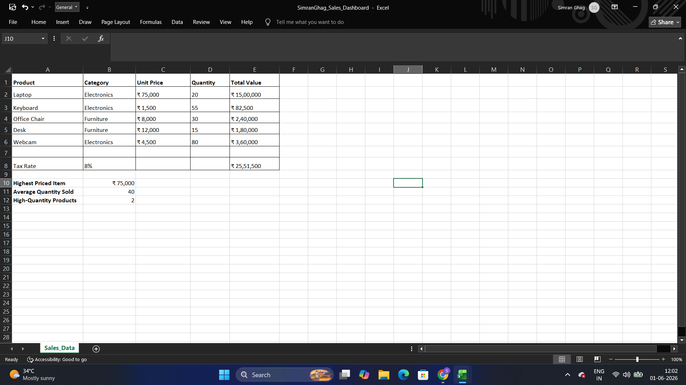

# Assignment 2 — Cell Referencing & Essential Formulas

For this one, I moved from just navigating Excel to actually making it calculate things for me — this is where formulas started clicking.

## What I Did

I built out a small **sales table** (Laptop, Keyboard, Office Chair, Desk, Webcam) with Unit Price and Quantity, and used it to practice cell referencing:

- I calculated **Total Value** for each product (`Unit Price × Quantity`) using relative references, so the formula adjusted correctly as I copied it down each row.
- I set up a single **Tax Rate** cell (8%) and referenced it as an absolute reference in my total-with-tax calculation, so every row pulled from that same fixed cell instead of breaking when copied.

Once I had the raw numbers, I practiced Excel's core aggregation functions to pull out a few KPIs:
- `MAX` to find the **Highest Priced Item**
- `AVERAGE` to get the **Average Quantity Sold**
- A conditional count to find how many products qualified as **High-Quantity Products**

This assignment really helped cement the difference between relative and absolute references for me — I kept messing up the Tax Rate formula until I locked it with `$` signs, and then it just worked.

*(Official assignment brief: [Brief/Assignment-2-Brief.pdf](./Brief/Assignment-2-Brief.pdf))*

## 📁 Files
| File | Description |
|------|-------------|
| `SimranGhag_Sales_Dashboard.xlsx` | My sales table with totals, tax, and KPI summary |
| `Screenshot.png` | Screenshot of the completed sheet |

## 🖼 Preview

