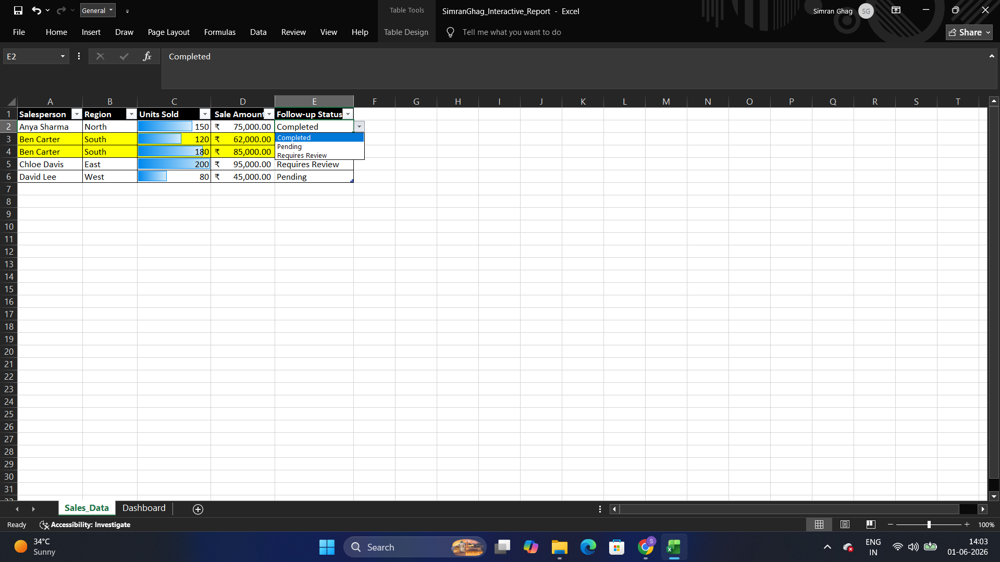
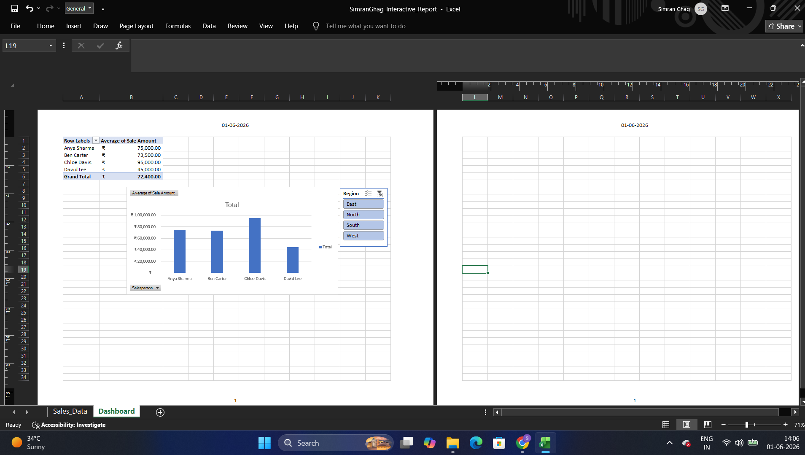

# Assignment 3 — Formatting, Pivot Tables & Data Management

This is where things started feeling like a "real" dashboard rather than just a spreadsheet. I built a sales tracker for a small team and turned it into something interactive.

## What I Did

I started with a raw **Sales_Data** sheet: Salesperson, Region, Units Sold, Sale Amount, and a Follow-up Status column. To make it easier to scan at a glance, I:

- Added **data bars** to the "Units Sold" column, so I could visually compare who sold what without reading every number
- Set up a **data validation dropdown** on "Follow-up Status" with three options — Completed, Pending, Requires Review — so status updates stay consistent instead of people typing random text

Then I moved to the **Dashboard** sheet, where I:

- Built a **pivot table** summarizing the average sale amount per salesperson
- Turned that pivot table into a **column chart** so the differences between salespeople are immediately visible
- Added a **Region slicer** (East / North / South / West) so I can filter the whole dashboard down to a specific region with one click

Working through this assignment is where slicers finally made sense to me — being able to just click a button and watch the chart update instantly felt like a real "aha" moment.

*(Official assignment brief: [Brief/Assignment-3-Brief.pdf](./Brief/Assignment-3-Brief.pdf))*

## 📁 Files
| File | Description |
|------|-------------|
| `SimranGhag_Interactive_Report.xlsx` | My sales data + interactive Dashboard sheet |
| `Table.png` | Screenshot of the raw data table |
| `Dashboard.png` | Screenshot of the interactive dashboard |

## 🖼 Preview
**Data Table**

**Interactive Dashboard**

