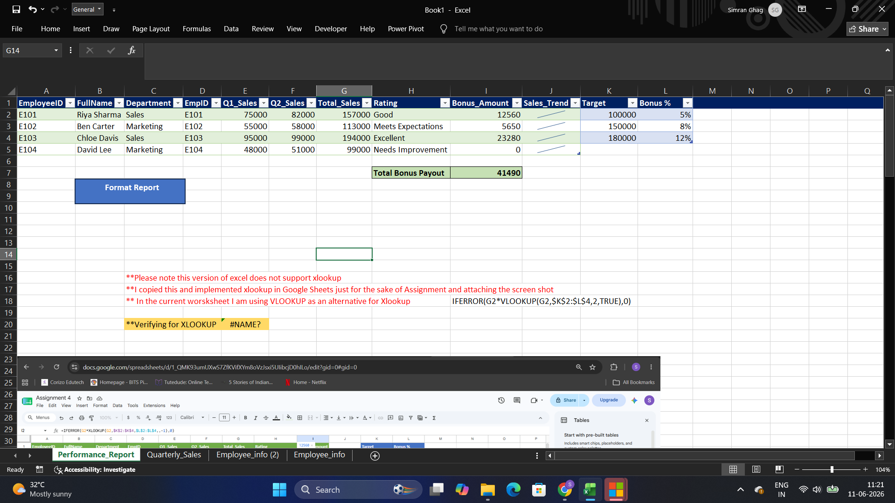

# Simran Ghag — Excel Certification — Tutedude

**Certified in Excel** through Tutedude's hands-on, project-based **Advanced Excel With AI** program (completed 11/06/2026). This repo contains all 4 assignments — navigation and data entry, formulas, pivot tables and dashboards, and Power Query with macros — written up in my own words: what I built, what I found in the data, and what actually clicked along the way, rather than a checklist of completed steps.

📄 **[View Certificate →](./certificate/certificate.pdf)**

---

## Skills Demonstrated

`Navigation & Editing` `Data Entry & AutoFill` `Relative vs. Absolute Referencing` `SUM/AVERAGE/MIN/MAX` `COUNT family` `SUMIF(S)/AVERAGEIF(S)` `Conditional Formatting` `Sort, Filter & Remove Duplicates` `Pivot Tables & Pivot Charts` `Slicers` `Data Validation` `Power Query (Merge Queries)` `IFS Nested Logic` `VLOOKUP` `Goal Seek` `Macros`

---

## Progression

The tasks build up in a natural arc: getting comfortable in the interface → core formulas and cell referencing → formatting data and building interactive pivot dashboards → Power Query, advanced lookups, and macros.

## Assignments

| # | Project | Preview | What It Demonstrates |
|---|---------|---------|------------------------|
| 1 | [Getting Started with Excel](./Assignment-01) |  | Navigation, editing sheets/cells, Quick Access Toolbar |
| 2 | [Cell Referencing & Essential Formulas](./Assignment-02) |  | Relative/absolute references, MAX/AVERAGE, conditional count |
| 3 | [Formatting, Pivot Tables & Data Management](./Assignment-03) |  | Data bars, data validation, pivot tables, slicers |
| 4 | [Power Query, Advanced Formulas & Macros](./Assignment-04) |  | Power Query merge, IFS, VLOOKUP, Goal Seek, macros |

All 4 assignments complete.

Each assignment folder includes its own `README.md` (what I built and why), the workbook, the official brief where provided, and supporting screenshots.

---

## Certificate

